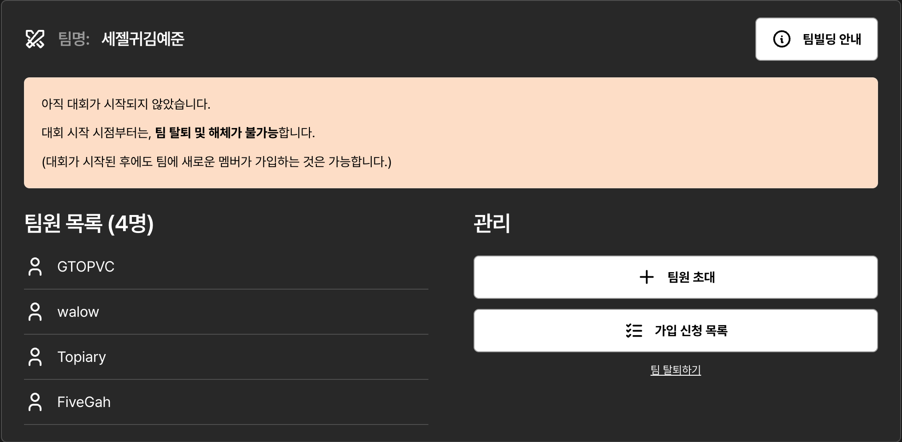
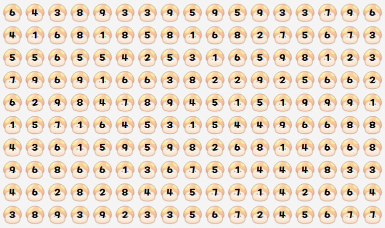
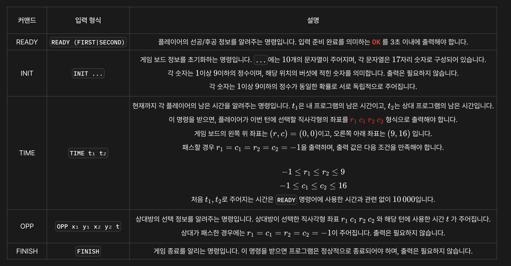
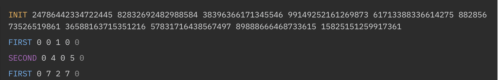
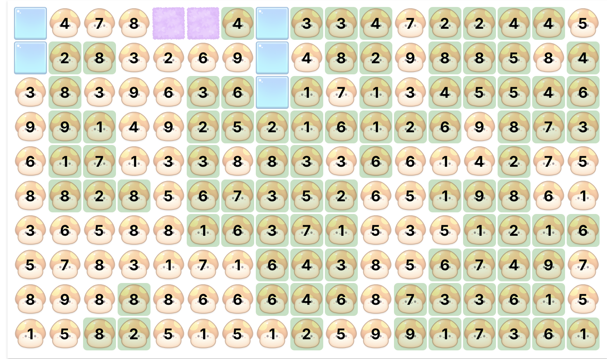
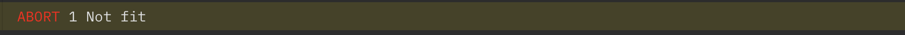

# 들어가기에 앞서
NYPC란, NEXON Youth Programming Cup의 약자로 2016년 부터 넥슨과 넥슨재단이 공동으로 주최하는 청소년 프로그래밍 대회이다. 이번에 대학생 및 만 19-24세 사이​ 성인을 위한 트랙​인 Master Track으로 3명의 팀원들과 함께 참가하게 되었다.

~~팀 이름이 잘못된거 같지만 아쉬운거다~~  
**이 글은 여기서 제공하는 연습문제 풀이 시간에 관한 글을 적어볼거다**

# 버섯 게임

우리가 흔히 아는 사과 게임과 비슷하다.  
게임 규칙은 다음과 같다.

# 게임규칙

> Rule 1  
> 플레이어는 자신의 턴에 버섯 밭에서 하나의 직사각형 영역을 선택합니다.

> Rule 2  
> 선택한 영역 내의 숫자 합이 정확히 10인 경우, 해당 영역의 버섯은 제거되며 플레이어가 그 영역을 점령합니다.
> 이때, 영역 안에 상대방이 이미 점령한 칸이 포함되어 있다면 해당 칸의 소유권도 빼앗을 수 있습니다.
> 또한, 선택한 직사각형의 네 변에는 각각 최소 하나 이상의 버섯이 영역 안쪽으로 인접해 있어야 합니다.

> Rule 3  
> 선택 가능한 영역이 없거나 전략적으로 선택을 하지 않으려 한다면, 선택을 생략하고 턴을 넘길 수 있습니다.

> Rule 4  
> 두 플레이어가 연속으로 턴을 넘기면 게임이 종료됩니다.
> 종료 시점에 더 많은 칸을 점령한 플레이어가 승리합니다.

사과 게임에 땅따먹기 게임을 결합해 놓은 형태라 볼 수 있다.

# 입출력 커맨드


```py
class Play():
    def __init__(self, board:list[list[int]]):
        self.board = board
    
    def inputboard(self, x1:int, y1:int, x2:int, y2:int) -> None:
        for i in range(x1, x2+1):
            for j in range(y1, y2+1):
                self.board[j][i] = 0
    
    def getTenRectengle(self) -> tuple[int, int, int, int]:
        ...

    def getShortage(self, x1:int, y1:int, x2:int, y2:int) -> tuple[int, int, int, int]:
        ...

def main():
    커맨드 입력받고 해당 커맨드에 맞는 값을 출력하는 함수이다.

if __name__ == "__main__":
    main()
```

껍데기는 이렇다.
> ### inputboard
> 입력값을 바탕으로 board에 0을 대입한다

> ### getTenRectengle
> board에서 10을 맞출수 있는 사각형의 시작지점과 끝지점을 알아낸다.  
> 이떄 리턴값은 x1, y1, x2, y2 형태의 tuple이다

> ### getShortage
> getTenRectengle에서 반환된 값들을 최소한의 넓이로 바꾼다.  
> 땅따먹기 형태가 같이 있어서 그런지 최소한의 넓이인 사각형을 출력해야 한다.

## getTenRectengle

핵심 로직은 다음과 같다
1. 각 행마다 다음 과정을 반복한다.
2. 0 < 직사각형 가로 길이 <= 16
3. 각 가로 길이 별로 현재 0 < 직사각형 세로 길이 < (9 - 현재 행 번호) 인 직사각형을 만든다.
4. 해당 직사각형 내에 있는 값이 10이면 반환한다.

```py
def getTenRectengle(self) -> tuple[int, int, int, int]:
    for column_index, column_data in enumerate(self.board): #각 행마다
        for start_num, start_data in enumerate(column_data):
            for end_num in range(start_num, len(column_data)):
                total = 0
                for y2 in range(column_index, len(self.board)):
                    sum_value = sum(self.board[y2][start_num:end_num+1])
                    total += sum_value
                    if total == 10:
                        x1 = start_num
                        y1 = column_index
                        x2 = end_num
                        y2 = y2
            
                        # x1, x2, y1, y2 = tuple(sorted([x1, x2]) + sorted([y1, y2]))
                        # 추후 최적화를 위해 사용한다.

                        # x1, y1, x2, y2 = self.getShortage(x1, y1, x2, y2)   
                        #후술할 함수이다

                        return x1, y1, x2, y2
                    elif total > 10:
                        break
    return -1, -1, -1, -1   #더이상 찾을게 없다면 넘기기 반환
```

이걸 실행 시키면 다음과 같이 정상 작동 함을 알 수 있다.



하지만 문제가 생긴다.


왜 이런 문제가 발생 할까?

여기서 해당 칸을 지우기 위해선 3, 3, 4만 지우면 되지만, 위의 알고리즘에 따르면 불필요한 영역까지 같이 선택됨을 알 수 있다

이 또한 마찬가지다

```

0 0 2 1
1 0 0 0
2 0 4 0

```
이런 패턴이 있을 경우도 있어
단순히
```py
if start_num == 0:
    ...
```
을 쓰기엔 힘들거 같다.

## getShortage

만들어진 사각형을 기준으로  
맨 위 부터 가로줄이 전부 0이면 맨 위부터 한칸씩 줄인다.  
맨 왼쪽부터 세로줄이 전부 0이면 맨 왼쪽부터 한칸씩 줄인다.
```py
def getShortage(self, x1:int, y1:int, x2:int, y2:int) -> tuple[int, int, int, int]:
    # 0 0 0 0
    # 0 0 2 1
    # 0 0 4 3

    #x1 = 0
    #x2 = 3
    #y1 = 0
    #y2 = 2

    result_x1 = x1
    result_y1 = y1
    #위쪽 제거
    for y in range(y1, y2+1):   #[0, 1, 2]
        if sum(self.board[y][x1:x2+1]) == 0:
            result_y1 += 1
        else:
            break
    #
    
    #왼쪽 제거
    for x in range(x1, x2+1):   #[0, 1]
        column_sum = sum(self.board[y][x] for y in range(y1, y2+1))

        if column_sum == 0:
            result_x1 += 1
        else:
            break
    
    return result_x1, result_y1, x2, y2
```

이렇게 함으로써 불필요한 부분을 삭제한다.

### 마치며..
여기까지가 기본적인 10을 찾아내는 알고리즘이다.  
v2에선 가장 넓은 영역을 차지하는 알고리즘을 통해 5/12를 기록했고,  
v3에선 한 수 앞을 보아 이른바 함정인 영역을 찾아내어 차단하는 알고리즘을 통해 8.5/12를 기록했다.  
아직 연습문제이긴 하지만 앞으로 28일에 이뤄질 예선이 궁금해진다.  