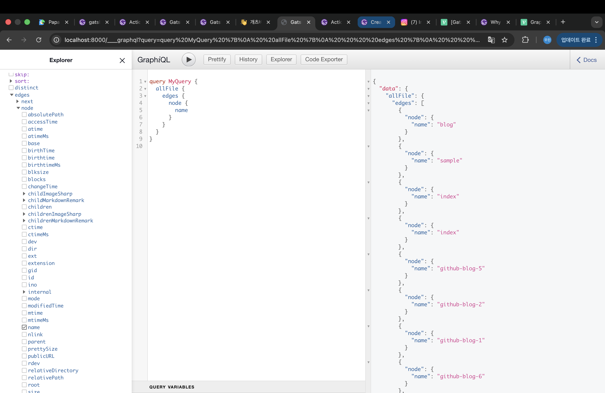

# 계기
---
마크다운으로 페이지를 만들수 있는 Jekyll 번들을 사용한 블로그 템플릿을 찾던 중 [줌코딩](https://github.com/zoomkoding)님의 [zoomkoding-gatsby-blog](https://github.com/zoomKoding/zoomkoding-gatsby-blog)을 발견했다. 처음 보는 프레임워크였지만 여태 본 블로그중 가장 시각적이여서 gatsby에 대해서 알아보기로 했다


# Gatsby란?
---
React 기반의 오픈 소스 정적 사이트 생성기(Static Site Generation) 프레임워크로, 다양한 소스로부터 하나의 데이터 레이어에서 관리 할 수 있는 프레임워크이다. 이에 뱅크 샐러드, 마켓컬리등 다양한 기업의 블로그에 사용되고 있는 프레임워크이다.

## 특징

#### `플러그인`
gatsby엔 리액트에서 사용되는 모듈과는 별개로 다양한 플러그인이 있고 사용된 플러그인은 gatsby-config.js에 추가해야한다. [추가정보](https://www.gatsbyjs.com/docs/tutorial/getting-started/part-3/)

#### `GraphQL`
Gatsby에 저장된 데이터를 조회하기 위한 언어, 빌드시 작동되며 하나의 통일된 언어로 다양한 자료를 불러올수 있어 프로그래머 친화적이다.

#### `빌드시 정적 html 파일 생성`
SSG 프레임워크의 특징으론, 빌드시 즉시 html 파일 형태로 저장이 된다. 페이지를 만들어 둬야 하는 형태이기 때문에 실시간 통신하는 사이트엔 불리할 순 있지만 SEO 수치가 높아 정적인 블로그 같은 사이트엔 유리하게 작용한다.

# Graphql
---

Gatsby에서 데이터 레이어에 저장된 다양한 데이터를 조회하기 위한 **쿼리 언어**이다.  
기존엔 서로 다른 데이터 형식을 서로 다른 방식을 사용해서 조회해야했다.  
하지만 Gatsby에선 모든 데이터를 Graphql 쿼리를 통해 조회할수 있도록 하였다.


http://localhost:8000/___graphql 에서 입력 쿼리와 출력값을 간편하게 조회할 수 있다.

<!-- field는 onCreateNode에서 추가한 사용자 지정 데이터가 들어가는 칸 -->
> ### Gatsby에서 Graphql을 사용하는 이유
> Gatsby Document의 [Why Gatsby Uses GraphQL](https://www.gatsbyjs.com/docs/why-gatsby-uses-graphql/)문서에 나와있다. 정리하면 다음과 같다.
> > #### 하드코딩의 경우 가져올수 있는 데이터에 한계가 존재한다.
>
> > #### Json과 같은 정적 데이터 파일을 사용할 경우
> > * 이미지와 상품 데이터가 소스 코드 내 서로 다른 위치에 있어서 관리가 불편하다.
> > * 이미지 경로가 소스 코드 기준이 아니라 빌드된 사이트 기준의 절대 경로라서, JSON 데이터만 보고 실제 이미지를 찾기가 헷갈린다.
> > * 이미지 최적화가 적용되어 있지 않아서, 최적화를 하려면 전부 수동으로 작업해야 한다.
> > * 전체 상품 미리보기 목록을 만들려면 모든 상품 정보를 한 번에 context로 넘겨야 해서, 상품 수가 많아질수록 관리가 매우 복잡해진다.
> > * 페이지를 렌더링하는 템플릿에서 데이터가 어디서 오는지 직관적이지 않아서, 나중에 데이터 수정이나 유지보수가 어려울 수 있다.  
>
> > #### api를 사용할 경우
> > 서버에선 엔드포인트를 작성하여 클라이언트에선 서버 주도적인 데이터 수신이 가능하지만
> > Graphql에선 클라이언트 주도적인 데이터 수집이 가능하다
>
> 이러한 불편한 초기 설정과 데이터를 사용하는 위치와 데이터를 불러오는 코드를 같은 곳에 둘 수 있다는 장점 덕분에 Graphql을 사용하는것이다.

기본 문법은
https://velog.io/@lovelys0731/GraphQL-%ED%86%BA%EC%95%84%EB%B3%B4%EA%B8%B0-2-GraphQL-%EA%B8%B0%EB%B3%B8-%EB%AC%B8%EB%B2%95Query-Mutation  
이 블로그를 참고하자

<br>
<br>
<br>
<br>
<br>

---
# 그럼 이제 이 템플릿을 뜯어보자
---

```text
├── assets/
├── content/
├── gatsby-browser.js
├── gatsby-config.js
├── gatsby-meta-config.js
├── gatsby-node.js
├── node_modules/
├── package-lock.json
├── package.json
├── public/
├── src/
    ├── components/
    ├── layout/
    ├── models/
    ├── pages/
    ├── styles/
    ├── templates/
    └── utils/
```

### gatsby-browser.js
> 브라우저 API 관련 파일

### gatsby-config.js
> 사이트에 대한 메타 데이터, 사이트에 사용된 플러그인등의 정보를 저장하는 파일 (해당 템플릿에선 메타 데이터를 별도의 파일에 저장했다)

### gatsby-meta-config.js
> 사이트에 대한 메타 데이터를 저장하는 파일

### gatsby-node.js
> 노드를 설정하는 파일
> > 노드란? GraphQL을 통해 조회할 수 있도록 Gatsby 내부 데이터 레이어에 저장된 각각의 데이터 객체 즉, 데이터 레이어의 기본 단위

### content/
Graphql로 사용될 데이터 소스들이 들어갈 디렉토리

### src/template
createPage로 만들어질 페이지의 근간이 되는 템플릿을 저장

<br>
<br>
<br>
<br>

# 사용된 플러그인들
---

#### `gatsby-source-filesystem`
로컬 파일을 Gatsby 데이터 레이어에 등록하는 역할

#### `gatsby-plugin-robots-txt`
이 사이트에 대한 권한을 제어, 호스팅시 사용하는 플러그인인듯

#### `gatsby-plugin-google-analytics`
Google Analytics 추적 코드를 삽입하는 플러그인, 광고 다룰때 사용

#### `gatsby-plugin-manifest`
웹앱 manifest 파일을 만들어주는 플러그인, 모바일 다룰떄 사용

#### `gatsby-transformer-remark`
.md파일을 MarkdownRemark 노드로 변환해줌, 후술로 제대로 다룰 예정

### `gatsby-remark-images`
마크다운 내 이미지 최적화 플러그인

#### `gatsby-remark-table-of-contents`
마크다운 제목들을 기반으로 목차를 만들어주는 플러그인

#### `gatsby-remark-prismjs`
마크다운 코드블럭에 문법 하이라이팅을 적용하는 플러그인

#### `gatsby-remark-autolink-headers`
마크다운 제목에 자동으로 링크를 붙여주는 플러그인

#### `gatsby-remark-copy-linked-files`
마크다운 안에서 링크한 파일을 빌드 결과물로 복사해주는 플러그인

#### `gatsby-remark-smartypants`
문장부호를 보기 좋은 형태로 바꿔주는 플러그인

#### `gatsby-theme-material-ui`
MUI 사용할수 있는 테마 플러그인

#### `gatsby-transformer-sharp`
이미지 파일을 Gatsby 이미지 처리 시스템에서 사용할 수 있도록 변환해주는 플러그인

#### `gatsby-plugin-advanced-sitemap`
사이트맵을 생성해주는 플러그인, SEO 수치 올리는거

#### `gatsby-plugin-sharp`
이미지 리사이징, 최적화, 포맷 변환 등을 담당하는 플러그인

#### `gatsby-plugin-image`
Gatsby의 최적화 이미지 컴포넌트를 사용할 수 있게 해주는 플러그인

#### `gatsby-plugin-offline`
사이트를 오프라인에서도 어느 정도 사용할 수 있게 만드는 플러그인

#### `gatsby-plugin-react-helmet`
react-helmet을 Gatsby에서 사용하기 위한 플러그인, SEO 수치 올리는데 사용됨

#### `gatsby-plugin-sass`
Sass/SCSS 파일을 사용할 수 있게 해주는 플러그인

<br>
<br>
<br>
<br>

# 핵심 코드

<br>
<br>


## 1. 블로그 생성

<!-- ```js
gatsby-node.js

exports.onCreateNode = ({ node, getNode, actions }) => {
  const { createNodeField } = actions;
  if (node.internal.type === `MarkdownRemark`) {    //마크다운 형식이라면
    const slug = createFilePath({ node, getNode, basePath: `content` });
    createNodeField({ node, name: `slug`, value: slug });
  }
};
```

노드를 만들때마다 실행되는 코드이다.
createFilePath를 통해 마크다운 파일 위치를 기반으로 slug를 만들고 노드에 slug 필드를 생성한다

```graphql
fields:{
    "slug":content/dir2/hello.md
}
...
```
노드가 자동으로 위와 같은 형식을 띈다 -->

```js
gatsby-node.js

exports.createPages = async ({ actions, graphql, reporter }) => {
  const { createPage } = actions;

  const results = await graphql(`
    {
      allMarkdownRemark(sort: { order: DESC, fields: [frontmatter___date] }, limit: 1000) {
        edges {
          node {
            id
            excerpt(pruneLength: 500, truncate: true)
            fields {
              slug
            }
            frontmatter {
              categories
              title
              date(formatString: "MMMM DD, YYYY")
            }
          }
          next {
            fields {
              slug
            }
          }
          previous {
            fields {
              slug
            }
          }
        }
      }
    }
  `);

  ...

  createBlogPages({ createPage, results });
  ...
};
```
> [createPages](https://www.gatsbyjs.com/docs/reference/config-files/gatsby-node/#createPages)는 빌드시 페이지를 만들기 위한 EntryPoint 역할을 하는 API이다. 파라미터를 통해 페이지를 만들때 필요한 함수인 createPage또한 action 인자를 통해 받아온다

> `gatsby-transformer-remark` 플러그인은 `gatsby-source-filesystem` 플러그인으로 생긴 파일 데이터중 .md 파일을 MarkdownRemark 노드로 GraphQL에 저장한다.  

> 이때 `allMarkdownRemark`은 ```Select * From MarkdownRemark```과 같은 역할을 하는 쿼리이다.
```js
gatsby-node.js

const createBlogPages = ({ createPage, results }) => {
  const blogPostTemplate = require.resolve(`./src/templates/blog-template.js`);
  results.data.allMarkdownRemark.edges.forEach(({ node, next, previous }) => {
    createPage({  //actions.createPage
      path: node.fields.slug,
      component: blogPostTemplate,
      context: {
        // additional data can be passed via context
        slug: node.fields.slug,
        nextSlug: next?.fields.slug ?? '',
        prevSlug: previous?.fields.slug ?? '',
      },
    });
  });
};
```
> gatsby 내장함수중에는 [createPage](https://www.gatsbyjs.com/docs/reference/config-files/actions/#createPage)가 있다. 각각의 파라미터는 다음과 같은 정보를 받는다
> * #### `path`  
>   url 경로 (/로 시작해야함)
> * #### `component` 
>   어떤 템플릿을 사용할지 절대 경로
> * #### `content`   
>   페이지에 넘길 데이터

### 핵심로직
```
빌드시 gatsby-source-filesystem 플러그인이 파일 데이터를 데이터 레이어에 저장 
                           ↓
gatsby-transformer-remark가 .md파일을 MarkdownRemark 노드로 바꾼후 쿼리 제공
                           ↓
gatsby-node.js에서 createPages api를 호출하고 인자 받기
                           ↓
createPages에서 모든 MarkdonRemark 노드 데이터들 graphql을 통해 가져오기
                           ↓
createBlogPages 함수에 createPage 함수와 가져온 데이터 보내고 실행
                           ↓
노드에 저장되어 있는 경로에 blog-template.js 템플릿을 기반으로 페이지 만들기
(현재글 주소와 다음글 주소, 이전글 주소도 보낸다)
```

<br>
<br>

## 2. 템플릿
```js
export const pageQuery = graphql`
  query($slug: String, $nextSlug: String, $prevSlug: String) {
    cur: markdownRemark(fields: { slug: { eq: $slug } }) {
      id
      html
      excerpt(pruneLength: 500, truncate: true)
      frontmatter {
        date(formatString: "MMMM DD, YYYY")
        title
        categories
        author
        emoji
      }
      fields {
        slug
      }
    }

    next: markdownRemark(fields: { slug: { eq: $nextSlug } }) {
      ...
    }

    prev: markdownRemark(fields: { slug: { eq: $prevSlug } }) {
      ...
    }

    site {
      siteMetadata {
        siteUrl
        comments {
          utterances {
            repo
          }
        }
      }
    }
  }
`;

```


> `query($slug: String, $nextSlug: String, $prevSlug: String)`   
> -> createPage에서 content 파라미터를 통해 다음과 같은 데이터들을 받는다

> 이때 html field는 해당 마크다운 파일의 내용이 들어가있는 필드이며,  
> frontmatter은 마크다운 상단  
> \---  
> emoji: 🔧  
> title: 개츠비(Gatsby) 접하기  
> ...  
> \---  
> 부분의 데이터를 가져온다

> site는 사이트 내부 정보를 통해 댓글 관련 필드를 가져온다.


```js
function BlogTemplate({ data }) {
  const curPost = new Post(data.cur);
  const prevPost = data.prev && new Post(data.prev);
  const nextPost = data.next && new Post(data.next);
  const { comments } = data.site?.siteMetadata;
  const utterancesRepo = comments?.utterances?.repo;

  return (
    <Layout>
      <Seo title={curPost?.title} description={curPost?.excerpt} />
      <PostHeader post={curPost} />
      <PostContent html={curPost.html} />
      <PostNavigator prevPost={prevPost} nextPost={nextPost} />
      {utterancesRepo && <Utterances repo={utterancesRepo} path={curPost.slug} />}
    </Layout>
  );
}

export default BlogTemplate;
```

> `data` 파라미터를 통해 graphql로 가져온 데이터를 컴포넌트에서 사용한다. 


<br>
<br>

# 마치며
---
우선 새로운 프레임워크를 알게 해주시고 좋은 블로그 템플릿을 오픈소스로 제공해주신 [줌코딩](https://zoomkod.ing/)님 감사합니다. 정적 웹사이트는 json 형태나 하드코딩 형태로 만들어왔는데 Gatsby라는 좋은 프레임 워크를 알게 되어 앞으로 정적 웹사이트에서 데이터를 효율적으로 관리할수 있겠다는 생각이 들었다.


### 참고 사이트
* https://www.gatsbyjs.com/docs/conceptual/graphql-concepts/
* https://www.gatsbyjs.com/docs/why-gatsby-uses-graphql/#create-pages-from-json-with-images
* https://www.gatsbyjs.com/docs/creating-and-modifying-pages/
* https://www.gatsbyjs.com/docs/reference/config-files/actions/
* https://www.gatsbyjs.com/docs/reference/config-files/gatsby-node/#createPages
* https://www.gatsbyjs.com/plugins/gatsby-transformer-remark/?=transformer
* https://oliveyoung.tech/2022-07-04/How-to-Develop-And-Migration-Blog-With-Gatsby/
* https://junghyeonsu.com/posts/gatsby-shovels-and-hacks/
* https://mnxmnz.github.io/gatsby/what-is-gatsby/